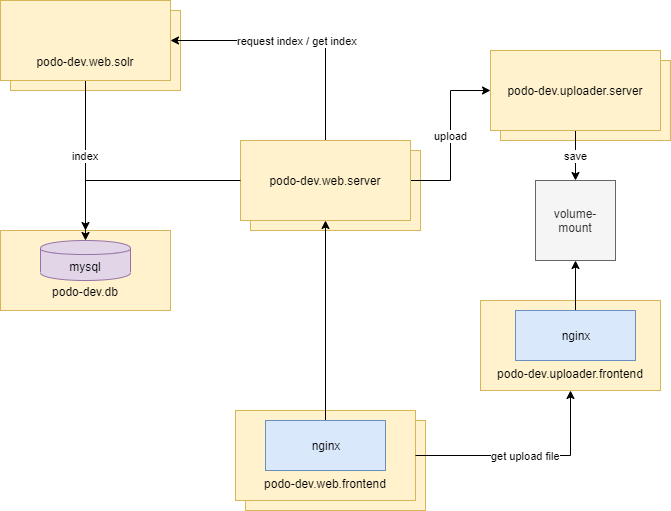

# podo-dev

podo 개발 블로그

- 블로그 [http://www.podo-dev.com](http://www.podo-dev.com)
- 상세 [https://www.podo-dev.com/blogs/150](https://www.podo-dev.com/blogs/150)

### Stack

- Spring boot 2.2.0
- Spring Jpa
- Spring Security, Oauth (Google)
- NuxtJs (VueJs)
- MySql
- Solr Search Engine

### Structure

> 설계상 이중화 되있지만
> 실제로 서버에는 이중화되어 있지 않음

### Module

`podo-dev-core`
- Utilities, Vo

`podo-dev-rest-client`
- Restful responses

`podo-dev-storage`
- 파일 저장소 서버

`podo-dev-web`
- Blog Web Server 
- Blog Frontend
- Sitemap, Rss 생성 스케줄 (* 작은 부분이라 별도 분리하지 않음)

